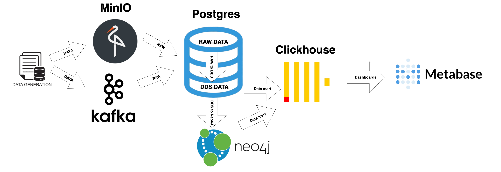
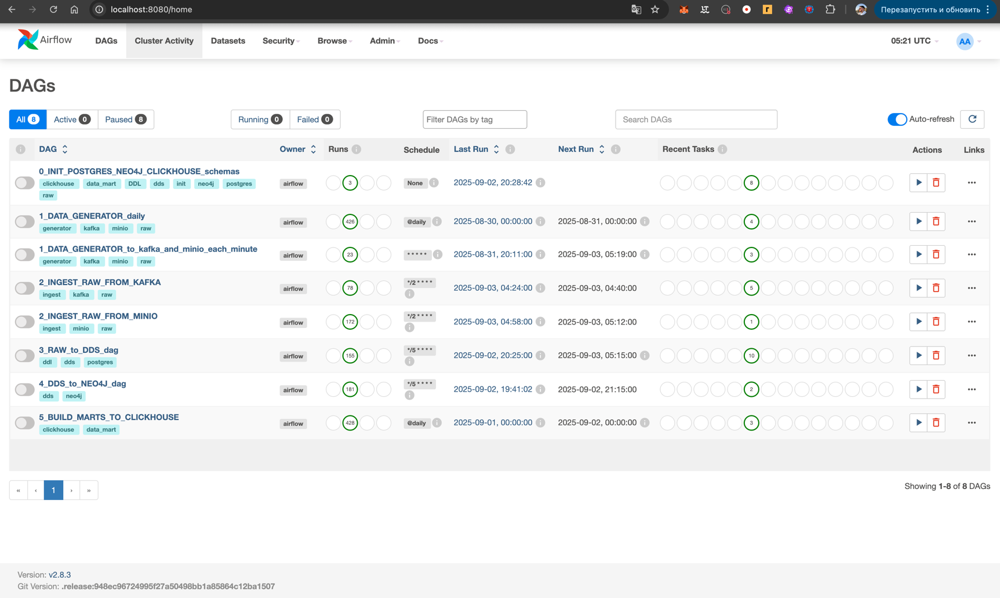
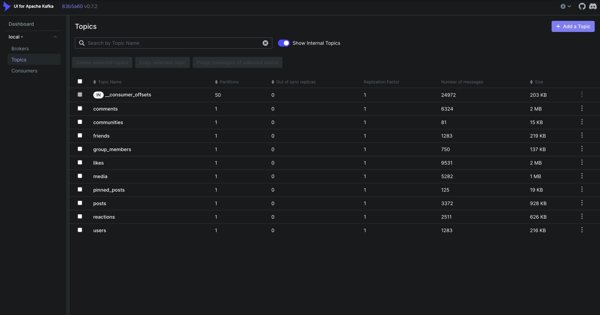
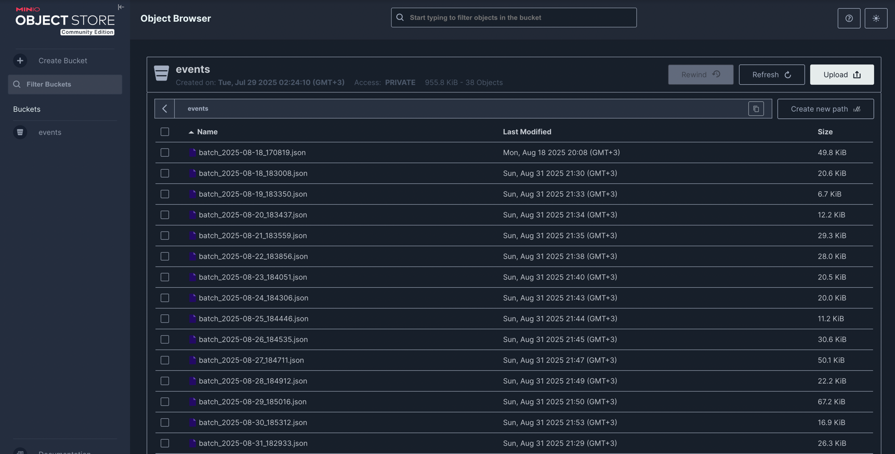
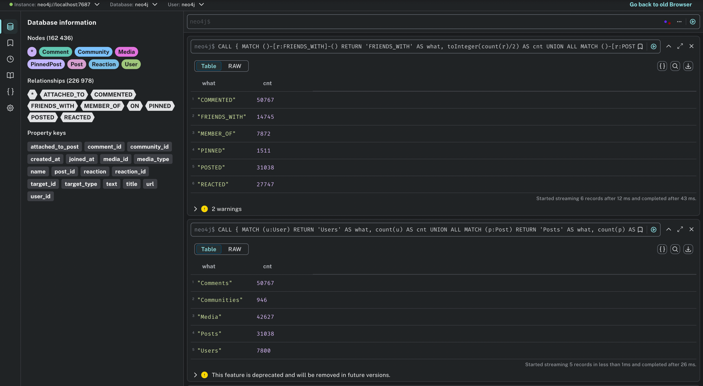
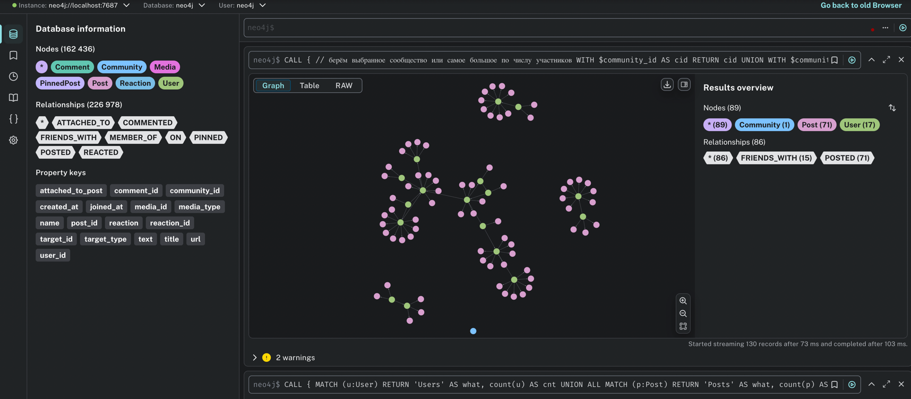
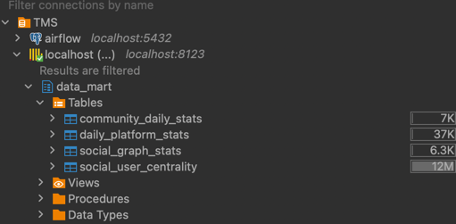
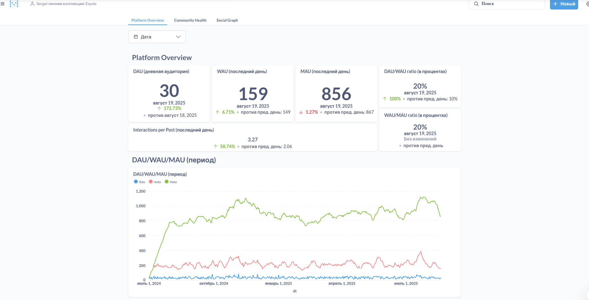

# TMS Data Engineering Project - Социальная сеть

## 📋 Описание проекта

Данный проект представляет собой комплексную систему обработки данных для социальной сети, построенную на основе современных технологий Data Engineering. Система включает в себя генерацию тестовых данных, их обработку через различные слои (RAW, DDS, Data Marts) и визуализацию результатов.


### Основные технологии:
- **Apache Airflow** - оркестрация ETL процессов
- **Apache Kafka** - потоковая обработка данных
- **MinIO** - объектное хранилище для batch данных
- **PostgreSQL** - реляционная база данных (RAW и DDS слои)
- **Neo4j** - графовая база данных для социальных связей
- **ClickHouse** - аналитическая база данных для витрин
- **Metabase** - система визуализации данных

### Слои данных:

1. **RAW слой** - сырые данные в PostgreSQL
2. **DDS слой** - нормализованные данные в PostgreSQL и Neo4j
3. **Data Marts** - агрегированные данные в ClickHouse

## 📊 Диаграмма архитектуры



## 🚀 Быстрый старт

### Установка и запуск

1. **Клонирование репозитория:**
```bash
git clone <repository-url>
cd diplom-tms
```

2. **Настройка переменных окружения:**
Создайте файл `.env` в корне проекта:
```env
# Airflow
AIRFLOW_UID
POSTGRES_USER
POSTGRES_PASSWORD
POSTGRES_DB

# ClickHouse
CLICKHOUSE_USER
CLICKHOUSE_PASSWORD
CLICKHOUSE_DB

# Neo4j
NEO4J_USER
NEO4J_PASSWORD

# MinIO
MINIO_ROOT_USER
MINIO_ROOT_PASSWORD
MINIO_BUCKET
```

3. **Запуск системы:**
```bash
docker-compose up -d
```

4. **Инициализация схем данных:**
```bash
# Запуск DAG для создания схем
docker-compose exec airflow-webserver airflow dags trigger 0_INIT_schemas
```

## 📁 Структура проекта

```
diplom-tms/
├── dags/                          # Airflow DAG'и
│   ├── create_schemas_dag.py      # Создание схем БД
│   ├── generate_events_dag.py     # Генерация тестовых данных
│   ├── transfer_raw_from_kafka_dag.py  # Загрузка из Kafka
│   ├── transfer_raw_from_minio_dag.py  # Загрузка из MinIO
│   ├── raw_to_dds_dag.py          # Трансформация RAW → DDS
│   ├── ttransfer_data_to_neo4j_dag.py  # Загрузка в Neo4j
│   ├── build_marts_dag.py         # Создание витрин
│   └── generate_data/             # Модули генерации данных
├── sql/                           # SQL скрипты
│   ├── ddl/                       # DDL скрипты
│   │   ├── raw/                   # Схема RAW слоя
│   │   ├── dds/                   # Схема DDS слоя
│   │   └── data_mart/             # Схема витрин
│   ├── dml/                       # DML скрипты
│   └── dql/                       # DQL скрипты
├── cypher/                        # Cypher скрипты для Neo4j
│   ├── ddl/                       # Создание узлов и связей
│   ├── dml/                       # Вставка данных
│   └── dql/                       # Запросы для витрин
├── processed_data/                # Модули обработки данных
│   ├── loaders/                   # Загрузчики данных
│   ├── utils/                     # Утилиты
│   └── config.py                  # Конфигурация
├── docs/                          # Документация
│   ├── screenshots/               # Скриншоты интерфейсов
│   └── architecture.png           # Диаграмма архитектуры
├── docker-compose.yml             # Docker конфигурация
└── requirements.txt               # Python зависимости
```

## 🔄 ETL процессы

### 1. Генерация данных (1_DATA_GENERATE_to_kafka_and_minio)
- **Расписание:** каждую минуту
- **Функция:** Генерация тестовых данных социальной сети
- **Выходные данные:** Kafka топики и MinIO bucket

### 2. Загрузка из Kafka (2_TRANSFER_RAW_FROM_KAFKA)
- **Расписание:** каждые 2 минуты
- **Функция:** Потоковая загрузка данных из Kafka в RAW слой
- **Топики:** users, posts, comments, likes, reactions, friends, communities, group_members, media, pinned_posts

### 3. Загрузка из MinIO (2_TRANSFER_RAW_FROM_MINIO)
- **Расписание:** каждые 2 минуты
- **Функция:** Batch загрузка данных из MinIO в RAW слой

### 4. Трансформация RAW → DDS (3_RAW_to_DDS_dag)
- **Расписание:** каждые 5 минут
- **Функция:** Нормализация и очистка данных
- **Зависимости:** Соблюдение порядка загрузки сущностей

### 5. Загрузка в Neo4j (4_DDS_to_NEO4J_dag)
- **Расписание:** каждые 5 минут
- **Функция:** Создание графа социальных связей
- **Компоненты:** Узлы и связи между пользователями, постами, комментариями

### 6. Создание витрин (5_CREATE_DATA_MARTS_TO_CLICKHOUSE)
- **Расписание:** ежедневно
- **Функция:** Агрегация данных для аналитики
- **Витрины:**
  - Ежедневная статистика платформы
  - Статистика сообществ
  - Статистика социального графа

## 🗄️ Модель данных

### Сущности социальной сети:

- **Пользователи (Users)** - основная сущность
- **Сообщества (Communities)** - группы пользователей
- **Посты (Posts)** - публикации пользователей
- **Комментарии (Comments)** - комментарии к постам
- **Медиа (Media)** - изображения и файлы
- **Лайки (Likes)** - реакции на контент
- **Реакции (Reactions)** - эмоциональные реакции
- **Друзья (Friends)** - связи между пользователями
- **Участники групп (Group Members)** - членство в сообществах
- **Закрепленные посты (Pinned Posts)** - важные посты сообществ

## 🖥️ Интерфейсы системы

### Apache Airflow (http://localhost:8080)

- **Логин:** airflow / airflow
- **Функции:** Мониторинг и управление ETL процессами

### Kafka UI (http://localhost:8081)

- **Функции:** Мониторинг топиков и сообщений

### MinIO Console (http://localhost:9001)

- **Логин:** minioadmin / minioadmin
- **Функции:** Управление объектным хранилищем

### PostgreSQL (localhost:5439)

- **Логин:** airflow / airflow
- **Базы данных:** airflow (метаданные), dwh (данные)

### Neo4j Browser (http://localhost:7474)


- **Логин:** neo4j / password
- **Функции:** Визуализация графа социальных связей

### ClickHouse (http://localhost:8123)

- **Логин:** airflow / airflow
- **Функции:** Аналитические запросы

### Metabase (http://localhost:3000)

- **Функции:** Создание дашбордов и отчетов

## 📈 Мониторинг и уведомления

Система включает Telegram уведомления о статусе выполнения DAG'ов:
- Успешное выполнение задач
- Ошибки в процессе обработки
- Статистика выполнения

## 🔧 Конфигурация

### Переменные окружения

Основные настройки системы задаются через переменные окружения в файле `.env`:

```env
# База данных
POSTGRES_HOST
POSTGRES_PORT
POSTGRES_USER
POSTGRES_PASSWORD
POSTGRES_DB

# ClickHouse
CLICKHOUSE_HOST
CLICKHOUSE_PORT
CLICKHOUSE_USER
CLICKHOUSE_PASSWORD
CLICKHOUSE_DB

# Neo4j
NEO4J_HOST
NEO4J_PORT
NEO4J_USER
NEO4J_PASSWORD

# Kafka
KAFKA_BOOTSTRAP_SERVERS

# MinIO
MINIO_BUCKET
```

## 🚨 Устранение неполадок

### Проблемы с запуском


2. **Ошибки подключения к БД:**
   - Проверьте, что все контейнеры запущены: `docker-compose ps`
   - Дождитесь полной инициализации: `docker-compose logs postgres`

3. **Проблемы с Airflow:**
   - Очистите логи: `docker-compose down -v && docker-compose up -d`
   - Проверьте права доступа: `chmod -R 777 logs/`

### Полезные команды

```bash
# Просмотр логов
docker-compose logs -f airflow-scheduler

# Перезапуск сервиса
docker-compose restart airflow-scheduler

# Очистка данных
docker-compose down -v

# Проверка статуса
docker-compose ps
```

## 📚 Дополнительные ресурсы

- [Apache Airflow Documentation](https://airflow.apache.org/docs/)
- [Neo4j Documentation](https://neo4j.com/docs/)
- [ClickHouse Documentation](https://clickhouse.com/docs/)
- [Kafka Documentation](https://kafka.apache.org/documentation/)

## 👥 Автор

**Serzik** - Data Engineer

## 📄 Лицензия

Проект создан в образовательных целях.

---

*Для получения дополнительной информации или поддержки, создайте issue в репозитории.*
